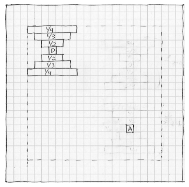
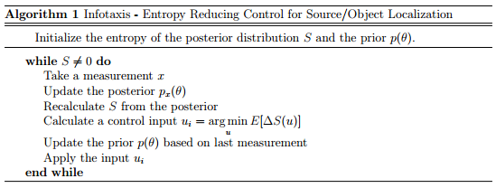
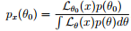
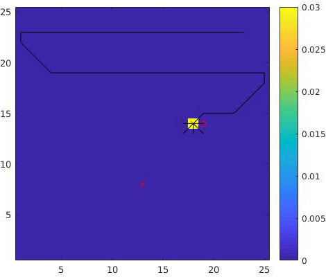
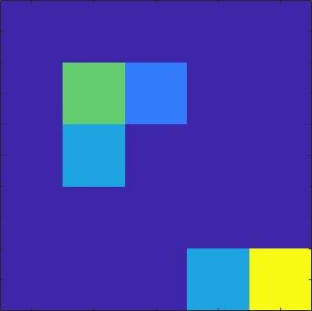
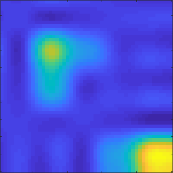
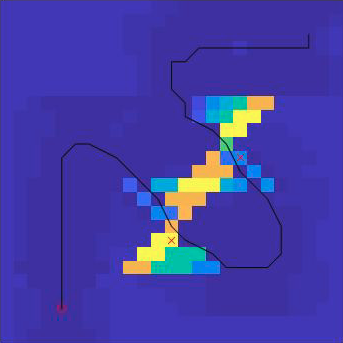
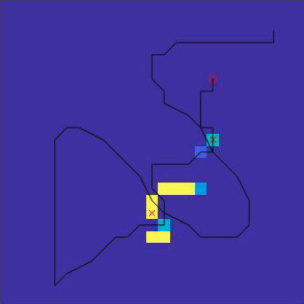
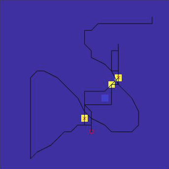
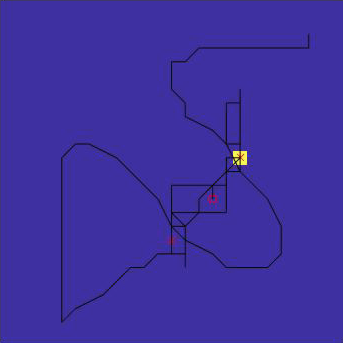

# Information Gain Methods for Object Search

This research project studies the application of two information gain methods in a search problem:
* **Infotaxis** - search guided by entropy minimization, documented in **subproject I**
* **Ergodic exploration** - search guided by proportional coverage, documented in **subproject II**

## Subproject I - Infotaxis

Searching in an unknown environment without gradient information can be challenging
for robotic agents. One potential controller in this scenario that balances between
exploitation and exploration is infotaxis, a strategy that maximizes information
gain in the search process. This repo uses entropy minimization as a proxy for
information gain to illustrate efficient localization of a target in the absence of gradient information.

### Problem statement - door localization

**Randomly place a door and an agent in a 25 * 25 grid world, find an Infotaxis trajectory.**

In the figure above, D is the location of the door and the values in the rectangles
around the door denote the measurement model, i.e. the probability of measuring a 1
in those locations. For all other locations, the probability of measuring 1 is 1/100.
The measurement model specifies how the door sensor queries the environment. Specifically,
the measurement does not occur in a radial basis fashion. Nor is it perfect, meaning it
could measure 1 when there is no door nearby or measure 0 in high probability area.

### Algorithm

The algorithm initializes a uniform prior, corresponding to the least certainty
and thus the highest entropy. As posterior refines after subsequent measurements,
high probability regions emerge and the overall entropy decreases. Specifically, &theta;
is a 25 * 25 matrix of the probability estimate of door at that cell location. Posterior
comes from weighting prior with the likelihood of making measurement x and then normalizing it with total probability as detailed in the following update rule:  . Consequently, posterior evolves in a way as shown in Fig 1, where darker the blue lower the probability. Notice initially the agent misses the true door because the sensor is imperfect, but it is able to locate the door eventually.

Fig 1. Posterior. Warmer color corresponds to higher probability

The appearance that the agent is exploring greedily&mdash;always chasing the highest probability region is only part of the story. The control input in the algorithm is chosen from one of the neighboring 8 cells that maximizes the expected entropy drop (we use argmin in the equation because *E* [&Delta;*S*(*u*)] is negative).

*E* [&Delta;*S*(*u*)] = *E* [*S*t+1 - *S*t] = *p*(*u* finds door) (-*S*t) + (1 - *p*(*u* finds door)) (*S*t+1 - *S*t)

The first term **exploits** the current belief and indeed drives the agent to the neighboring cell where the door is most probably located, as finding the door will collapse the entropy to 0. But the second term introduces **exploration** by considering the query of which neighboring cell will result in the largest entropy drop or information gain in the case of not finding the door. Therefore, the agent is following the entropy minimizing path as shown below in Fig 2, where the agent goes to the darkest neighboring cell.

Fig 2. Expected Entropy Change. Darker color corresponds to larger entropy drop

### Future Work

One limitation of this algorithm is that the agent will stuck at the first door it finds. Thus it does not apply to multi-door localization. In the following subproject, I use **ergodic exploration** to solve this problem.

## Subproject II - Ergodic Exploration

For an active sensing problem, I have shown **Infotaxis** is an efficient strategy to locate a target in an unknown environment. However, in cases of multiple targets or distractors, Infotaxis often gets stuck at the first target it comes across and fails to explore the entirety of space. A solution is to use ergodicity as the control signal for optimization. This subproject uses ergodic exploration to localize a target in the presence of a distractor.

### Motivation

Fig 3 shows Infotaxis fails to visit the second door (marked by cross), because finding the first door will concentrate almost all probability to that location. An ergodic trajectory alternatively distributes exploration time proportionally to the spatial distribution of belief and consequently achieves coverage. We continue with the same task outlined in subproject I, but introduce one true door as target and another fake door as distractor (with slightly lower detection probability than true door).

<!--  -->

Fig 3. Infotaxis gets stuck at the first door detected

### Ergodicity

Ergodicity here specifically refers to the ergodicity of a trajectory *X*(t) with respect to a probability distribution &Phi;(x). We define that a trajectory is perfectly **ergodic** with respect to a distribution if the amount of time spent in a neighborhood &Nu; of the state space is proportional to the spatial distribution in the neighborhood &int;N&Phi;(*s*)d*s* . However, *X*(t) and &Phi;(x) live in different domain and to compute a distance metric between them we need to project them onto a common space. The space we choose is Sobolev space and we project *X*(t) to *c*k which is the Fourier coefficients of the spatial statistics of the trajectory, and &Phi;(x) to &phi;k, which is the Fourier coefficients of the spatial distribution, both via multi-dimensional Fourier transform. Because Sobolev space forms a Hilbert space, we can use inner product to specify the distance between *c*k and &phi;k. Consequently, we have a way to quantify how ergodic a trajectory is with respect to the current distribution. The figures below serve as an example how to use Fourier coefficients to represent a distribution. Fig 4 is an example distribution, while Fig 5 is the distribution reconstructed from the Fourier coefficients.

| | |
|-----------------------|--------------------|
|Fig 4. Original distribution | Fig 5. Reconstructed from Fourier representation|

### Ergodic Control

Now we have a **differentiable** distance metric, we can take the directional derivative to do gradient descent to improve the ergodicity of a trajectory. The specific algorithm is attached below. Notice a big difference between this approach and Infotaxis is that Infotaxis chooses the optimal action according to the newly updated distribution at each step, while ergodic control computes a long horizon trajectory and sticks to the same trajectory until finished even as the agent starts to make measurements and update posterior distribution. Once a trajectory is carried out, the agent computes the next optimally ergodic trajectory according to the new distribution. This process is iterated until all goal locations are visited and found.

<!--  -->

To produce the following figures, I use iterative Linear Quadratic Regulator (iLQR) to solve for the optimal trajectory. Fig 6 - 9 consist of a sequence of ergodic trajectories. Fig 6 is the first ergodic trajectory based off a uniform prior. The trajectory tries to cover as much space as possible. Once the measurements are made, I compute the second ergodic trajectory using the posterior in Fig 7. The agent goes back to revisit the two likely door locations. Fig 8 shows the agent has pinpointed the two door locations, while Fig 9 shows the agent has found the true door. The slight difference in terms of the probability of detection between the true door and the fake door can be picked up through multiple visits. But it is imperative that the agent should visit both doors at least once, and ergodic control ensures that.

| | |
|-------------------|-------------------|
|Fig 6. First trajectory | Fig 7. Second trajectory|
| | |
|Fig 8. Third trajectory | Fig 9. Fourth trajectory|

### Code

For code, please find my contact at my [portfolio page](https://yanweiw.github.io). Cover image is an ergodic trajectory over a Gaussian distribution.
