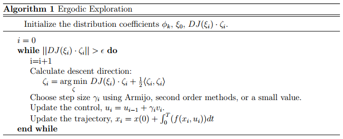

# Infotaxis - entropy minimizing search

Searching in an unknown environment without gradient information can be challenging
for robotic agents. One potential controller in this scenario that balances between
exploitation and exploration is infotaxis, a strategy that maximizes information
gain in the search process. This repo uses entropy minimization as a proxy for
information gain to illustrate efficient localization of a target in the absence of gradient information.

### Problem statement - door localization

**Randomly place a door and an agent in a 25 * 25 grid world, find an Infotaxis trajectory.**


In the figure above, D is the location of the door and the values in the rectangles
around the door denote the measurement model, i.e. the probability of measuring a 1
in those locations. For all other locations, the probability of measuring 1 is 1/100.
The measurement model specifies how the door sensor queries the environment. Specifically,
the measurement does not occur in a radial basis fashion. Nor is it perfect, meaning it
could measure 1 when there is no door nearby or measure 0 in high probability area.

### Algorithm



The algorithm initializes prior to be uniform, corresponding to the least certainty
and thus the highest entropy. As posterior refines after subsequent measurements,
high probability area emerges and overall entropy decreases. Specifically, `&theta`;
is a 25 * 25 matrix of the probability estimate of door at that cell location. Posterior
comes from weighting prior with the likelihood of making measurement x and then normalizing it with total probability as detailed in the following update rule:  . Consequently, posterior evolves in the following fashion, where darker the blue lower the probability. Notice initially the agent misses the true door because the sensor is imperfect, but it is able to locate the door eventually.


Fig 1. Posterior

Although it appears the agent is exploring greedily&mdash;always chasing the highest probability region, it is only part of the story. The control input in the algorithm is chosen from one of the neighboring 8 cells that maximizes the expected entropy drop (we use argmin in the equation because `*E* [&Delta;*S*(*u*)]` is negative).

```*E* [&Delta;*S*(*u*)] = *E* [*S*<sub>t+1</sub> - *S*<sub>t</sub>] = *p*(*u* finds door) (-*S*<sub>t</sub>) + (1 - *p*(*u* finds door)) (*S*<sub>t+1</sub> - *S*<sub>t</sub>)```

On the one hand, the first term says finding the door will collapse the entropy to 0, so that the neighboring cell that has the highest probability of finding the door will push the agent to go there, corresponding to exploitation. On the other hand, the second term says in the case of not finding the door calculates the entropy drop after the new measurement. Thus a neighboring cell that will reduce uncertainty the most will push the agent to go there, corresponding to exploration. Combining both, what the agent is really doing is to follow the entropy minimizing path as shown below where the agent goes to the darkest neighboring cell.


Fig 2. Expected Entropy Change

### Future Work

One limitation of this algorithm is that the agent will stuck at the first door it finds. Thus it does not apply to multi-door localization. In another project, I use ergodic exploration to solve this problem. For code, please find my contact at my [portfolio page](yanweiw.github.io).
